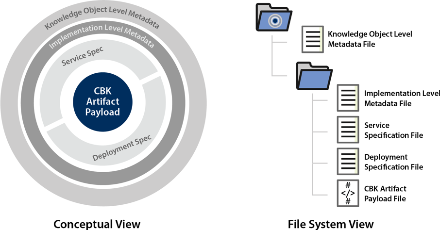

# Anatomy of a knowledge object

Conceptually, a knowledge object represents computable knowledge as both a resource and a service. That is, it contains a description of what it does, and the code to do it. Also, in order to make the object findable, accessible, interoperable, and reusable, the KO has enough metadata to describe itself as both resource and service.

Here's a picture....

----



----

Let's take a look at what's inside a knowledge object, starting from the top level folder....
```
99999-fk4a1s2d3 
  - metadata.json
  impl_a
    - metadata.json
    - service.yaml
    - deployment.yaml
    - index.js
```

## The top level knowledge object

### Metadata

In the packaged object metadata is kept in two `json` files, one for the object as a whole, and the other for each implementation. (KOs can have multiple implementations, **BUT JUST DON'T!** That's a packaging thing, so see [Organizing your code]() and [Packaging and publishing]() )

Metadata at the top level includes an identifier, minimal description data, and required knowledge object properties from the Knowledge Object Information Ontology (KOIO)

`99999-fk41a2s3d/metadata.json`
```json 
{
  "@id": "hello-world",
  "@type":"koio:KnowledgeObject",
  "identifier":"ark:/hello/world",
  "title":"Hello World Title",
  "contributors": "Kgrid Team",
  "description": "Test Hello World ",
  "keywords": "test hello world",
  "hasImplementation":[
    "hello-world/v0.1.0","hello-world/v0.2.0","hello-world/v0.3.0"
  ],
  "@context" : ["http://kgrid.org/koio/contexts/knowledgeobject.jsonld" ]
}
```

Descriptive metadata elements like `title` or `description`, administrative metadata like `identifier`, and technical metadata like the `koio:KnowledgeObject` the element are descrbed in the section [More about Metadata]()

may be repeated at the implementation level. We recommend using standard *dcterms* metadata elements, or similar. Some items may be required (see [KO Metadata standard]()). You may add additional descriptive or domain specific metadata elements as needed. We recommend you use standard vocabularies and express them in the `context` element so as to enable metadata use in linked data scenarios.

### The `hasImplementation` element

Notice that the top-level metadata uses the `hasImplementation` element to point to one or more implementations. In the KO package an implementation is represented by a folder containing all the required and optional files needed to deploy the object in a suitable runtime and route requests to the service it exposes.

::: warning
While multiple implementation folders (each with its own version identifier) are allowed, it can complicate things in source code. We prefer to version the code in a typical SCM workflow and generate a new release (with a new version identifier) as part of the KO packaging step. See [Packaging and publishing]().
:::

## The *implementation* folder itself

### Metadata

Just as in the top-level object, the implementation has it's own metadata. THe identifier element should extend the parent's identifier (ARK), adding an additional version string. While there is no constraint on the version string we suggest using a [semantic versioning scheme](https://semver.org/). In some cases, additional specifiers might make sense, e.g. `ark://99999-fk41a2s3d/v.1.2-simple` vs. `ark://99999-fk41a2s3d/v.1.2-simple`.

::: tip
One of the difficulties in versioning knowledge objects arises from their dual nature. They are both code objects *and* small services. Versioning code and versioning service APIs each have their own set of drivers. Don't worry about that for now; the topic is addressed further in [Packaging and Publishing]().
:::

and the implementation metadata 
`99999-fk41a2s3d/impl_a/metadata.json`
```json
{
  "@id": "v0.1.0",
  "@type": "koio:Implementation",
  "identifier": "ark:/hello/world/v0.1.0",
  "title": "Implementation koio v1 of Hello World",
  "hasServiceSpecification": "v0.1.0/service.yaml",
  "hasPayload": "v0.1.0/welcome.js",
  "@context": [
    "http://kgrid.org/koio/contexts/implementation.jsonld"
  ]
}
```

